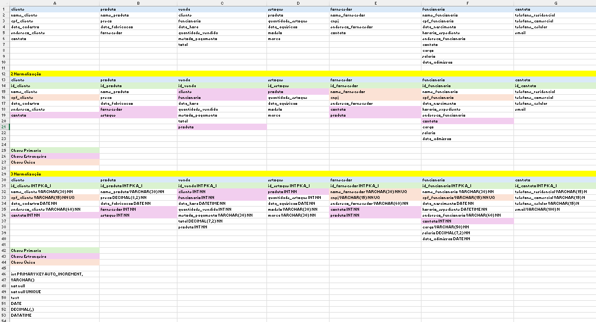
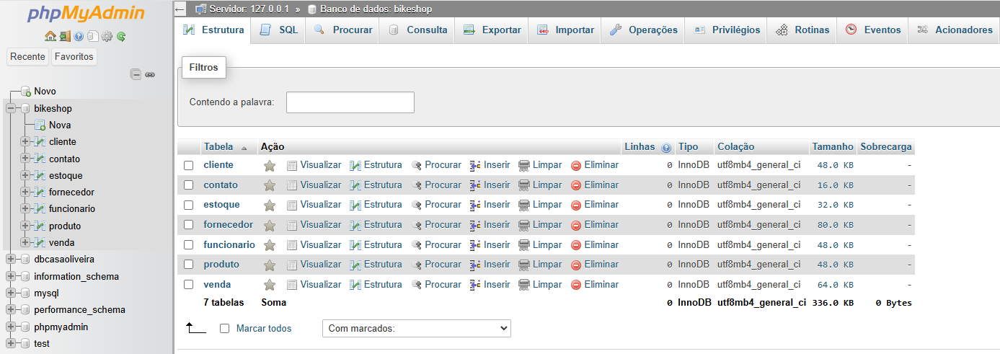
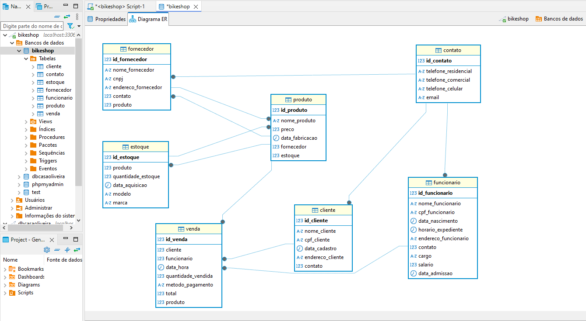

# Atividade 
## BikeShop

Empresa: BikeShop
Visão Geral:
A BikeShop é uma empresa especializada na venda de bicicletas e acessórios relacionados. 
Localizada em uma área urbana movimentada de Uberlândia, Minas Gerais, a empresa tem 
como objetivo oferecer uma variedade de bicicletas e acessórios de alta qualidade para 
ciclistas de todos os níveis, desde iniciantes até ciclistas experientes e entusiastas.

Desafio:
A BikeShop está crescendo rapidamente e enfrenta desafios no gerenciamento eficiente de seu 
estoque, clientes e vendas. Atualmente, eles estão registrando essas informações 
manualmente ou usando planilhas eletrônicas (Excel), o que se tornou ineficiente e propenso a 
erros. Eles reconhecem a necessidade de um sistema de banco de dados centralizado que 
possa armazenar e gerenciar essas informações de forma mais eficaz.

Objetivos do Sistema de Banco de Dados:
Gerenciar o estoque de bicicletas e acessórios, incluindo detalhes como modelo, marca, 
quantidade em estoque, preço de venda e fornecedor.
Manter um registro centralizado de clientes, incluindo informações como nome, endereço, 
número de telefone, endereço de e-mail e histórico de compras.
Registrar e acompanhar as vendas de bicicletas e acessórios, incluindo detalhes como data da 
venda, produtos vendidos, preço de venda, método de pagamento e vendedor responsável.

Abordagem Proposta:
A BikeShop planeja desenvolver um sistema de banco de dados personalizado usando 
tecnologias modernas de banco de dados, como MySQL ou PostgreSQL. Eles planejam 
colaborar com desenvolvedores de software especializados para projetar e implementar o 
sistema de acordo com seus requisitos específicos. O sistema será acessado por funcionários 
autorizados por meio de uma interface de usuário intuitiva, onde poderão realizar todas as 
operações necessárias de forma eficiente.

Benefícios Esperados:
Melhoria na eficiência operacional, permitindo que a BikeShop gerencie seu estoque, clientes e 
vendas de forma mais rápida e precisa.
Maior satisfação do cliente, oferecendo um serviço mais personalizado e mantendo um 
histórico detalhado das interações anteriores.
Melhoria na tomada de decisões comerciais com base em relatórios e análises de dados 
precisos e atualizados.

Com um sistema de banco de dados eficiente e bem projetado, a BikeShop está confiante de 
que poderá atender às demandas de seus clientes de maneira mais eficaz e continuar 
prosperando no mercado de bicicletas

### Modelo Conceitual

### Esquema de Tabela para DB

### Modelo Relacional do DB

### Modelo Físico: código que gera o banco de dados

CREATE TABLE cliente(
	id_cliente int PRIMARY KEY AUTO_INCREMENT,
	nome_cliente varchar(30) not null,
	cpf_cliente varchar(15) not null UNIQUE,
	data_cadastro DATE not null,
	endereco_cliente varchar(60) not null,
	contato int not null
);

CREATE TABLE produto(
	id_produto int PRIMARY KEY AUTO_INCREMENT,
	nome_produto varchar(30) not null,
	preco DECIMAL(8,2) not null,
	data_fabricacao DATE not null,
	fornecedor int not null,
	estoque int not null
);

CREATE TABLE venda(
	id_venda int PRIMARY KEY AUTO_INCREMENT,
	cliente int not null,
	funcionario int not null,
	data_hora DATETIME not null,
	quantidade_vendida int not null,
	metodo_pagamento varchar(30) not null,
	total DECIMAL(7,2) not null,
	produto int not null
);

CREATE TABLE estoque(
	id_estoque int PRIMARY KEY AUTO_INCREMENT,
	produto int not null,
	quantidade_estoque int not null,
	data_aquisicao DATE not null,
	modelo varchar(100) not null,
	marca varchar(40) not null
);

CREATE TABLE fornecedor(
	id_fornecedor int PRIMARY KEY AUTO_INCREMENT,
	nome_fornecedor varchar(30) not null UNIQUE,
	cnpj varchar(15) not null UNIQUE,
	endereco_fornecedor varchar(40) not null,
	contato int not null,
	produto int not null
);

CREATE TABLE funcionario(
	id_funcionario int PRIMARY KEY AUTO_INCREMENT,
	nome_funcionario varchar(30) not null,
	cpf_funcionario varchar(15) not null UNIQUE,
	data_nascimento DATE not null,
	horario_expediente DATETIME not null,
	endereco_funcionario varchar(50) not null,
	contato int not null,
	cargo varchar(50) not null,
	salario DECIMAL(7,2) not null,
	data_admissao DATE not null
);

CREATE TABLE contato(
	id_contato int PRIMARY KEY AUTO_INCREMENT,
	telefone_residencial VARCHAR(15) null,
	telefone_comercial VARCHAR(15) null,
	telefone_celular VARCHAR(15) null,
	email VARCHAR(100) null
);

------------------------------------------------------------------

alter table cliente
add constraint `fk_cliente_pk_contato`
foreing key cliente(`contato`)
references contato(`id_contato`);

alter table produto
add constraint `fk_produto_pk_fornecedor`
foreing key produto(`fornecedor`)
references fornecedor(`id_fornecedor`);

alter table produto
add constraint `fk_produto_pk_estoque`
foreing key produto(`estoque`)
references estoque(`id_estoque`);

alter table venda
add constraint `fk_venda_pk_cliente`
foreing key venda(`cliente`)
references cliente(`id_cliente`);

alter table venda
add constraint `fk_venda_pk_funcionario`
foreing key venda(`funcionario`)
references funcionario(`id_funcionario`);

alter table venda
add constraint `fk_venda_pk_produto`
foreing key venda(`produto`)
references produto(`id_produto`);

alter table estoque
add constraint `fk_estoque_pk_produto`
foreing key estoque(`produto`)
references produto(`id_produto`);

alter table fornecedor
add constraint `fk_fornecedor_pk_produto`
foreing key fornecedor(`produto`)
references produto(`id_produto`);

alter table fornecedor
add constraint `fk_fornecedor_pk_contato`
foreing key fornecedor(`contato`)
references contato(`id_contato`);

alter table funcionario
add constraint `fk_funcionario_pk_contato`
foreing key funcionario(`contato`)
references contato(`id_contato`);